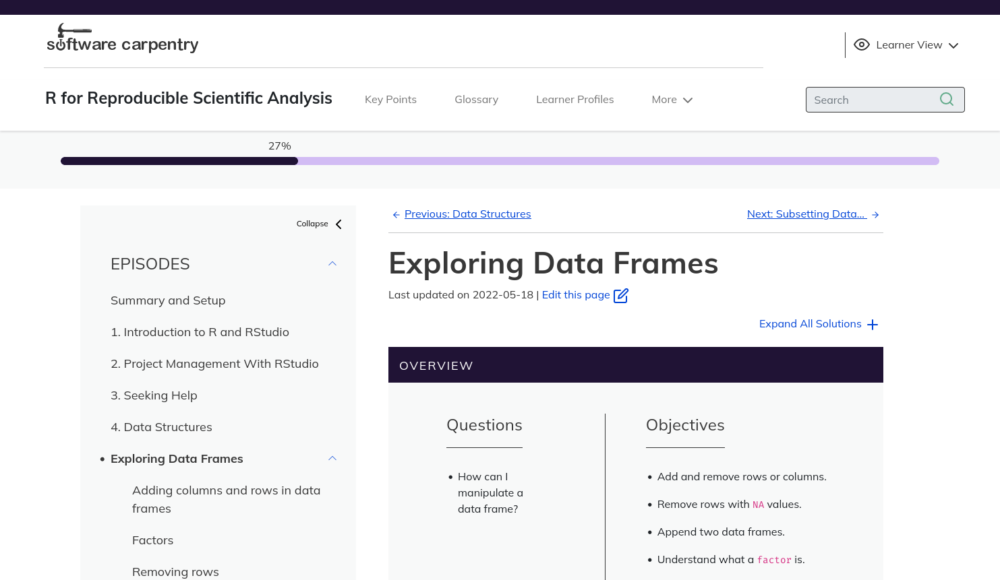
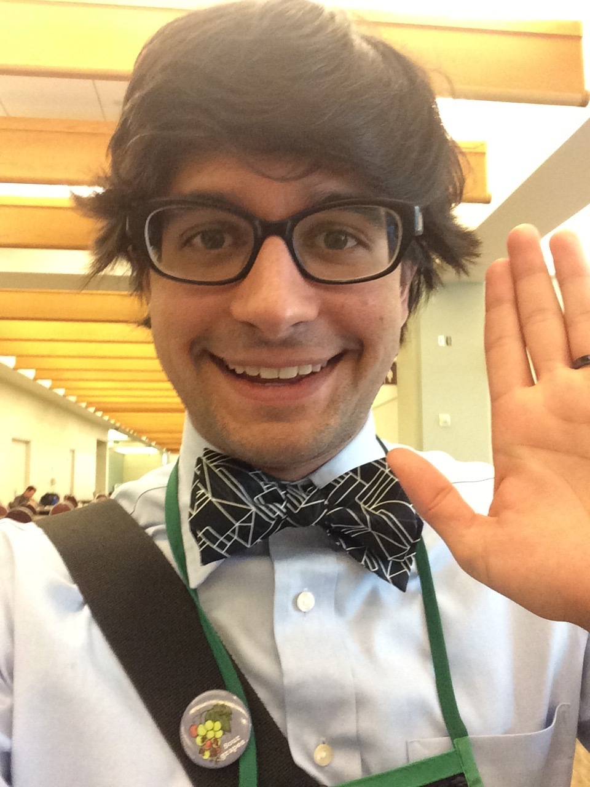
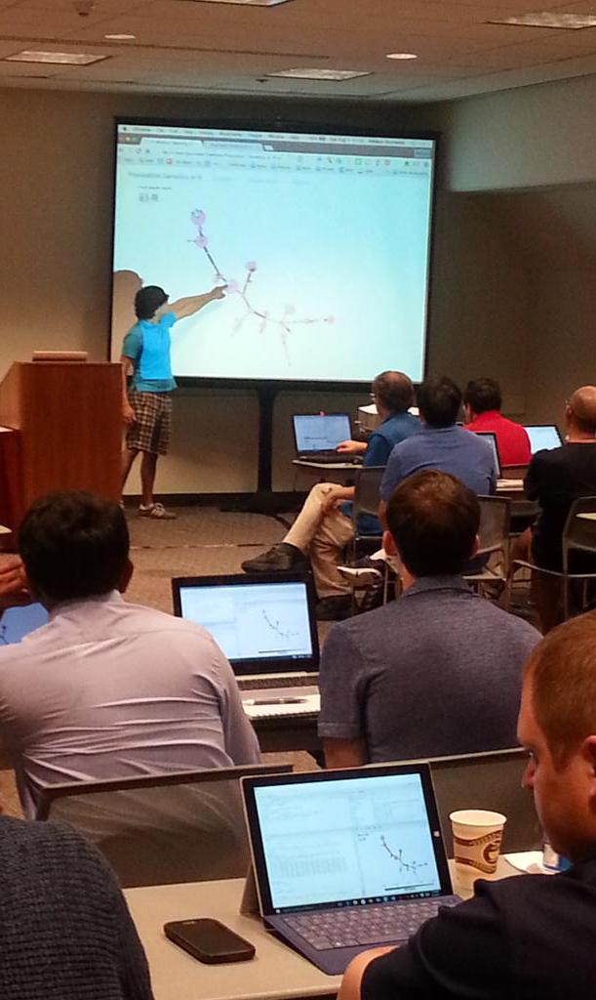

background-color: var(--cp-fog)
class: center, middle

.galaxy-brain[\[acknowledgements slide\]]

---

background-color: var(--cp-fog)


---
background-color: var(--cp-software-light)

---
background-color: var(--cp-buttercup)
background-size: 50%
class: center, middle
.pull-left[

]

--

.pull-right[

]
---

background-color: var(--cp-general-light)
background-image: url("img/carpentries-full-logo.svg")
background-size: 75% 
background-position: 50% 33%
class: center, bottom

.cp-fire.brain[
**spreading data science skills    
to researchers around the globe**
<br>
<br>
<br>
<br>

]

```{r setup, include=FALSE}
options(htmltools.dir.version = FALSE)
# comment
```

???

The Carpentries is a global organization of volunteers who teach
foundational data and coding skills to researchers worldwide. 

*ALT: The Carpentries Logo*

---

background-color: var(--cp-general-light)
class: center, middle


???

The Carpentries is a global organization of volunteers who teach
foundational data and coding skills to researchers worldwide. 

*ALT: The Carpentries Logo*

---
background-color: var(--cp-general-light)
class:center,middle

.pull-left[
.large-brain[.c-blue[&emsp;**We are...**]]    
.brain[
Always Learning    
.c-red[**Inclusive of All**]    
]]

.pull-right[
.large-brain[.c-blue[&emsp;**We...**]]  
.brain[
  Act Openly     
  Empower One Another    
  .c-red[**Value All Contributions**]
]
]


.center[
.large-brain[.c-blue[&emsp;**We champion...**]]   
.brain[
.c-red[**People First**]    
Access for All    
Community Collaboration    
Strength Through Diversity
]]

???

What makes us stand out is not the fact that we use evidence-based practices in
teaching, it's that we align all of our decisions with our core values: we put
people first and we value all contributions.


---
background-color: var(--cp-buttercup)
background-image: url("img/map.svg")
background-size: 100%

---
background-color: var(--cp-buttercup)
class: center, middle

# Never Teach Alone

---
background-color: var(--cp-buttercup)
class: center, middle

# Open Source Materials

---
class: inverse, center, middle

.galaxy-brain.cp-wand[Jekyll]

---
class: inverse, center, middle

.galaxy-brain[
If you have ever    
used Jekyll...

.cp-golden[Clap Twice]
]

---
class: inverse, center, middle

.galaxy-brain[
If you have ever     
.cp-pond[uttered a curse word]    
while using Jekyll...


.cp-golden[Clap Twice]
]

---
class: inverse, center, middle

.galaxy-brain[
If you have ever     
.cp-fire[wanted to set your laptop on 🔥]    
while using Jekyll...

.cp-golden[.brain[please] Clap Twice]
]


---
background-color: var(--cp-buttercup)
background-image: url("img/hex-collection.png"), url("img/blob-left.svg")
background-size: 50%, 55%
background-position: 92%, 95%
class: middle

.galaxy-brain.c-blue[
The    
Carpentries    
Workbench
]

---
background-color: var(--cp-sky)
background-image: url("img/sandpaper.png")
background-size: 45%
class: middle


---
background-color: var(--cp-dawn)
background-image: url("img/pegboard.png")
background-size: 45%
class: middle


---
background-color: var(--cp-wand)
background-image: url("img/varnish.png")
background-size: 45%
class: middle


---
background-color: var(--cp-sky)
class: center

# Core Values Driven Design

.large-brain.cp-midnight.left[

people first


community collaboration


always learning & access for all


empower one another
]


---
background-color: var(--cp-sky)
class: center

# core values driven design

.large-brain.cp-midnight.left[

.cp-lake.galaxy-brain[people first]


community collaboration


always learning & access for all


empower one another
]

---
background-color: var(--cp-buttercup)
class: middle

# Champion .cp-fire[People First]


---
background-color: var(--cp-buttercup)
class: center, middle


[](https://twitter.com/yabellini/status/1523268802653212672)

---
background-color: var(--cp-sky)
class: center

# core values driven design

.large-brain.cp-midnight.left[

people first

.cp-lake.galaxy-brain[community collaboration]

always learning & access for all

empower one another
]


---
background-color: var(--cp-buttercup)
class: center

# Champion Community Collaboration


---
background-color: var(--cp-sky)
class: center

# core values driven design

.large-brain.cp-midnight.left[

people first

community collaboration

.cp-lake.galaxy-brain[always learning & access for all]

empower one another
]

---
background-color: var(--cp-buttercup)
class: center

# Always Learning and Inclusive of All


---
background-color: var(--cp-sky)
class: center

# core values driven design

.large-brain.cp-midnight.left[

people first

community collaboration

always learning & access for all

.cp-lake.galaxy-brain[empower one another]
]


---
background-color: var(--cp-sky)
class: center,middle

# Don't Take It From Me!

---
background-color: var(--cp-buttercup)
background-image: url("img/saba.png")
background-position: 5% 50%
background-size: 50%
class: center, middle


.pull-right[
## Saba Ferdous
.brain[Associate Lecturer, UCL;]
.brain[Learn To Discover]
.cp-fire.brain[
> It was **very trivial and efficient** to \[write custom lessons\] in The Carpentries Workbench
]
<https://learntodiscover.github.io/Basic_Python>
]

---
background-color: var(--cp-buttercup)
background-image: url("img/toby.png")
background-position: 5% 50%
background-size: 50%
class: center, middle


.pull-right[
## Toby Hodges
.brain[Curriculum Lead    
The Carpentries]
.cp-fire.brain[
> **The Workbench has made it easier** for people to write, maintain, 
and teach lessons, in many different ways---sometimes quite profoundly
]
]

---
background-color: var(--cp-buttercup)
background-image: url("img/sarah.png")
background-position: 5% 50%
background-size: 40%
class: center, middle


.pull-right[
## Sarah Stevens
.brain[Data Science Facilitator    UW Madison]
.cp-fire.brain[
> I'm really excited to be able to rely on the workbench's **accessibility features**.
]
]

---
background-color: var(--cp-buttercup)
background-image: url("img/francois.png")
background-position: 5% 50%
background-size: 50%
class: center, middle


.pull-right[
## Fraçois Michonneau
.brain[Best Boss Ever]
.cp-fire.brain[
> You only have to focus on writing the content and **The Workbench takes care of the rest**.
]
]

---
background-color: var(--cp-buttercup)
class: center

# Get Involved!


