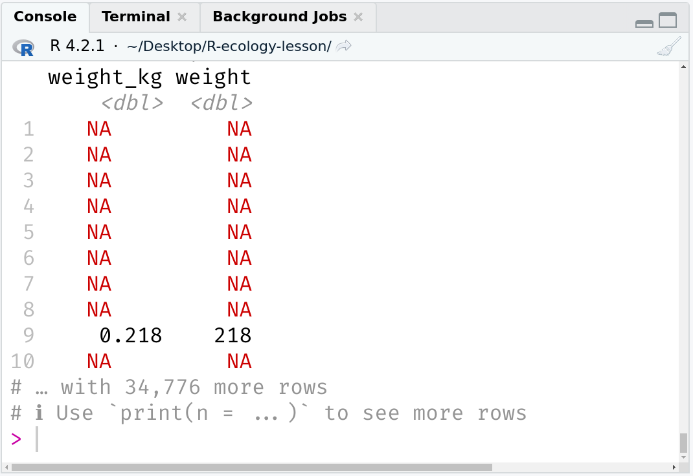

class: title-slide, inverse, center, middle

.title[# Building Accessible Lessons <br> .cp-pond[with R and Friends]]
.brain.author[
Zhian N. Kamvar .cp-wand[(he/him)]  <br> Lesson Infrastructure at [The Carpentries](https://carpentries.org/)<br>.smol-brain[2022-07-28 14:10 EDT]
]
.brain.institute[

Slides: .cp-dawn[https://bit.ly/BALWRAF]<br> Twitter: .cp-dawn[[@zkamvar](https://twitter.com/zkamvar)]<br>GitHub: .cp-dawn[[zkamvar](https://twitter.com/zkamvar)]<br><br>
]

???

Hello, I'm Zhian Kamvar and I work on Lesson Infrastructure at The Carpentries.
I'm going to tell you two things: how you can use The Carpentries
Workbench to build accessible lessons, and how we used R to build the Workbench,
which allowed us to transform our lessons from looking like this

---

background-color: var(--cp-fog)
class: middle,center


???


To looking like this

---
background-color: var(--cp-software-light)
class: middle,center


???

---
background-color: var(--cp-buttercup)
class: center

.large-brain[Acknowledgements]

.brain[A]
Achintya Rao,
Aleksandra Nenadic,
Alison Presmanes Hill,
Alycia Crall,
Angela Li,
Athanasia Monika Mowinckel,
Angelique Trusler,
.brain[C]
Christina Koch,
Christophe Dervieux,
.brain[D]
Daniel Chen,
Danielle Sieh,
David Pérez-Suárez,
Dhavide Aruliah,
Drake Asberry,
.brain[E]
Emily de la Mettrie,
Eric Jankowski,
Erin Becker,
Eirini Zormpa,
Ezra Herman,
.brain[F]
Fan Du,
François Michonneau,
.brain[G]
Greg Wilson,
.brain[H]
Hadley Wickham,
Heather Turner,
.brain[I]
Ian Flores Siaca,
.brain[J]
J.J. Allaire,
James Sadler,
Jenny Bryan,
Jeroen Ooms,
Joel Nitta,
Jon Haitz Legarreta Gorroño,
Jon Wheeler,
Jonah Duckles,
Juan Fung,
Janetta Steyn,
Jamie Jamison,
Jennifer Stubbs,
.brain[K]
Karen Word,
Kari Jordan,
Kate Hertwick,
Kevin Ushey,
Kozo Nishida,
.brain[L]
Liane Newton,
Luis J. Villanueva,
.brain[M]
Maëlle Salmon,
Maneesha Sane,
Mateusz Kuzak,
Maxim Belkin,
Michael Culshaw-Maurer,
Michael Joseph,
.brain[N]
Naupaka Zimmerman,
Nischal Shrestha,
.brain[O]
Omar Khan,
.brain[P]
Philipp Matthias Schäfer,
.brain[R]
Robin Long,
.brain[S]
Sarah Brown,
Sarah Stevens,
Saranjeet Kaur,
Scott Chamberlain,
Shaun C. Gaynor,
Simon Christ,
Saba Ferdous,
Sher! Hurt,
.brain[T]
Toby Hodges,
Tracy Teal,
.brain[V]
Vini Salazar,
.brain[Y]
Yanina Bellini Saibene,
Yihui Xie    
 
&nbsp;
&nbsp;
 
&nbsp;
&nbsp;

&nbsp;
&nbsp;
 
&nbsp;
&nbsp;
 

???

There are a lot of people and funding institutions that I need to thank
for supporting this work, and that can be a talk in and of itself. 

And in order for me to give this talk, you need to know who The Carpentries are
and before I get to that, I'm going to tell you a little story about myself.

---
background-color: var(--cp-buttercup)
class: center,middle

.pull-left[
]


???

Back in 2014, when I was a grad student, I wrote and ran my first workshop
teaching plant pathologists how to do population genetics in R (if you are
unfamiliar with population genetics in plant pathology, think 23 and me, 
but for mold).

--

.pull-right[

.credit[**photo credit: Sydney Everhart**]]

???

  - I knew a lot about popgen and plant pathology, but I knew next to nothing
    about inclusive teaching, live coding practices, or effective lesson
    development
  - Build website using RMarkdown, forced my collaborators to start using Git,
    fixed a lot of merge conflicts
  - Rebuilding the website was always a "close your eyes and hope it works"
    kinda process
  - We ran the workshop successfully at two conferences, but something was
    missing: we had no clue _what_ our workshop participants actually learned
    from it.
  - Here's the thing, my advisor had not taught for several years befor this,
    If I had a way to get support I needed, such as a template for a lesson that
    would guide me in narrative elements and formative assessment, I could have
    succeeded in understanding what people learned from the workshop.
    I know now that the carpentries is a community that provides that support
    and gives people a safe space to grow and improve their teaching.

---

background-color: var(--cp-general-light)
background-image: url("img/carpentries-full-logo.svg")
background-size: 75% 
background-position: 50% 33%
class: center, bottom

.visually-hidden[Image: The Carpentries Logo]
.cp-fire.brain[
**spreading data science skills    
to researchers around the globe**
<br>
<br>
<br>
<br>

]


???

The Carpentries is a global organization whose mission is to spread data science
skills to researchers around the globe, thus democratizing access to data.

We do this by building and fostering communities of practice

---

background-color: var(--cp-general-light)
class: center, middle


.credit[**photo credit: Bérénice Batut**]

???

The Carpentries community is made up of volunteers who are trained in and
dedicated to evidence-based teaching practices. This includes not only
instructors, but instructor trainers, and lesson maintainers as well. We may all
come from different backgrounds, but we come together through our core values


---
background-color: var(--cp-general-light)
class:center,middle

.pull-left[
.large-brain.cp-midnight[.cp-lake.brain[(Motivation)] **We are...**]    
.brain[
.cp-fire[**Always Learning**]    
Inclusive of All    
]]

--

.pull-right[
.large-brain[.c-blue[.cp-lake.brain[(Practice)] **We...**]]  
.brain[
  Act Openly     
  .cp-fire[**Empower One Another**]    
  Value All Contributions
]
]

--

.center[
.large-brain[.c-blue[.cp-lake.brain[(Goals)] **We champion...**]]   
.brain[
.c-red[**People First**]    
Access for All    
Community Collaboration    
Strength Through Diversity
]]

???

And for the last decade, we have shown that by acting on these values, we can
achieve so much. 

---
background-color: var(--cp-general-light)
background-image: url("img/map.svg")
background-size: 100%

.visually-hidden[
A world map with several countries shaded in progressively darker shades of blue
representing the number of workshops taught in each country since 2012. Every
continent on the globe has several countries in which workshops have been taught.
The lightest shade is Antarctica, representing 1 workshop, and the darkest is
the USA
]

???

Since 2012 and as of the end of 2021, we have run 
 - 3,000 workshops in 
 - 64 countries and trained 
 - 3,419 volunteer instructors to deliver our 
 - 45 collaboratively developed, open lessons to 
 - 74,000 novice learners at our 
 - 92 member sites.

This is all achieved because, when we teach workshops, we never teach alone.

---
background-color: var(--cp-general-light)
class: center, middle

<br>
.credit[**photo credit: Karen Word**]

???

When you teach a workshop for the first time, there is always at least one other
instructor who has taught this workshop before who can give you support. And
there are ALWAYS workshops that you can teach thanks to the efforts of the (soon
to be) Dr. SherAaron Hurt, our Director of Workshops. 


Workshops and continued learning only possible through open-source and
open-licensed lesson materials freely available on GitHub

---
background-color: var(--cp-general-light)
background-image: url("img/styles-github.png")
background-size: 100%
class: center, middle

.visually-hidden[
Image: Screenshot of the python-novice-inflammation GitHub repository in the
SWCarpentry organisation. It shows 2,585 commits, 249 stars, and 708 forks. 
]


???

And it is these lesson materials that I want to focus the rest of my talk
because, over the years, we have noticed that our core values have not been
well-reflected in our lesson infrastructure.

These lessons have a long history in how they were built, originally being
written in pure HTML, but as it stands now, they are built using Jekyll.

---
class: inverse, center, middle

.galaxy-brain.cp-wand[Jekyll]

.brain.cp-dawn[GitHub's Default Site Generator]

???

And I want to pause here and do a bit of audience participation. I'm going to
ask you some questions, and if the answer is "yes", clap twice. Okay? Ready?

---
class: inverse, center, middle

.galaxy-brain[
If you have ever    
used Jekyll...

.cp-golden[Clap Twice]
]

---
class: inverse, center, middle

.galaxy-brain[
If you have ever     
.cp-pond[uttered a curse word]    
while using Jekyll...


.cp-golden[Clap Twice]
]

---
class: inverse, center, middle

.galaxy-brain[
If you have ever     
.cp-fire[wanted to set your laptop on 🔥]    
while using Jekyll...

.cp-golden[.brain[please] Clap Twice]
]


---
class: inverse, middle

.brain[
`$ brew install ruby`    
`$ brew info ruby`     
`$ gem install jekyll bundler`    
`$ jekyll serve`    
.cp-fire[`ERROR: command 'jekyll' not found`] .cp-golden[(ㅠ\_ㅠ)]    
`$ bundle exec jekyll serve`    
.cp-fire[`ERROR: missing dependencies`] .cp-golden[(屮ﾟДﾟ)屮]    
`$ bundle install`    
.cp-fire[`ERROR: compilation failed for nokogiri`]    
.cp-golden[(╯°□°）╯︵ ┻━┻]

]

???

Over the last few years, we began to notice that our infrastructure was still
serving as a barrier. People were intimidated by the folder structure and the
toolchain used to build the lessons. In short, it was not easy to use.

---
class: inverse, middle, center


???

In 2020, I was hired to re-imagine the lesson infrastructure from the ground up 


---
background-color: var(--cp-mist)
class: middle, center


???

We knew that we wanted a system to avoid having a lesson wrapped around a blog where the tools, the inputs and the outputs were kept separate.  
This lead to the creation of The Carpentries Workbench 
---
background-color: var(--cp-buttercup)
background-image: url("img/hex-collection.png"), url("img/blob-left.svg")
background-size: 50%, 55%
background-position: 92%, 95%
class: middle

.galaxy-brain.c-blue[
The    
Carpentries    
Workbench
]

.visually-hidden[
Image: three isomorphic hex stickers on over a buff-coloured blob. The three hex stickers (sandpaper, pegboard, and varnish) all look like little workshops with different stages of planning, shaping, and finishing a wooden version of the carpentries logo, which is a stylized wrench tightening a bolt that also looks like a person who is holding up their arms in a joyous cheer. 
]

???

It operates on a modular workflow that clearly separates source files from
derivatives and the tools needed to build them. 
Based on the design of the {pkgdown} package, it consists of three R packages
that provide control, validation, and styling for lessons based on carpentries
principles.

---
background-color: var(--cp-sky)
background-image: url("img/sandpaper.png")
background-size: 45%
class: bottom


.bottom.credit[**hex design: Omar Khan**]

???

Sandpaper is the package that you work with directly to build your lesson website
from markdown or RMarkdown.

---
background-color: var(--cp-dawn)
background-image: url("img/pegboard.png")
background-size: 45%
class: bottom


.bottom.credit[**hex design: Omar Khan**]

???

Pegboard is running in the backend and provides pre-flight validation for your
lesson to ensure all of the markdown components make sense. 

---
background-color: var(--cp-wand)
background-image: url("img/varnish.png")
background-size: 45%
class: bottom


.bottom.credit[**hex design: Omar Khan**]

???

Varnish comes in at the end and provides HTML, CSS, and JavaScript styling for
the website, and if you don't like it, you can create your own package. 

In our re-imaginging of the infrastructure, we utilized what I like to call
core-values driven design

---
background-color: var(--cp-sky)
class: center, middle

# Core Values Driven Design

.large-brain.cp-midnight.left[

people first


always learning & access for all


empower one another
]

???

We used our core values to inform how we would redesign the infrastructure so
that it best served our community, and I'm going to highlight a few here. 

---
background-color: var(--cp-sky)
class: middle

.galaxy-brain[Champion **.cp-fire[People First]**]

???

Starting with our goal to Champion People First

We believe that the individuals who make up our community are the most important part of our organisation and our strongest resource.

When I was searching for a generator for our lessons, I looked for candidates
that would have plenty of onramps for beginners and ended up with R

---
background-color: var(--cp-buttercup)
class: center, middle


[](https://twitter.com/yabellini/status/1523268802653212672)

???

R is just chock-full of welcoming communities, which you all probably have felt
at this very conference and it only makes sense that we would want to support a
language that has a supportive community. 

---
background-color: var(--cp-sky)
class: middle

.galaxy-brain[Champion **.cp-fire[People First]**]

???

Of course, the workbench stands out in another way. 

---
background-color: var(--cp-buttercup)
class: center,middle

.brain[`lesson-website.url/episode`]


???

Thinking about the lesson contents themselves, another way we have championed
people first is to virtually increase the number of instructors you teach with. Sometimes, you need extra tips for working with the lessons in the context of teaching a lesson, such as this situation here. 


---
background-color: var(--cp-buttercup)
class: middle

```r
surveys |>
  mutate(weight_kg = weight / 1000)
```
.center[]

???

When you display a wide tibble on a zoomed-in RStudio screen, it's difficult to
discern where the "weight" columns are and throws a bit of chaos into the
teaching.

But, by incorporating in-line instructor notes into the lessons, experienced
instructors can communicate with other instructors through time. 

---
background-color: var(--cp-buttercup)
class: center,middle

.brain[`lesson-website.url/episode`.cp-lake[`/instructor`]]


???

And you have a chance to change your approach

---
background-color: var(--cp-buttercup)
class: middle
```r
surveys |> 
  mutate(weight_kg = weight / 1000) |>
* select(weight, weight_kg)
```
.center[]


---
background-color: var(--cp-sky)
class: middle

.galaxy-brain[Champion **.cp-fire[People First]**]

???

Finally, the workbench centers people first by avoiding "this works on my
machine" arguments.

---
background-color: var(--cp-buttercup)
class: middle, center


???

A common situation encountered used to be be package updates causing errors in
our lessons. 

---
background-color: var(--cp-buttercup)
class: middle
.pull-left.middle[
```r
library(sandpaper)

use_package_cache()

manage_deps()
```
]

.pull-right[

]
???

The workbench uses {renv} in the background for R lessons so that they come with
batteries included. Importantly, when developing a lesson, you do not need to
know how to use {renv} to work with the lesson.

And this really ties in with the next set of core values. 

---
background-color: var(--cp-sky)
class: middle

.galaxy-brain[
We Champion .cp-fire[**Access for All**]

We are .cp-fire[**Always Learning**]
]
???

---
background-color: var(--cp-buttercup)
class: center, middle


???

Access for all means that you are not limited by what you can install in order
to work with and evaluate contributions to your lesson. 

Pull requests are great for showing you what's changed in your lesson,
but when you are working with R Markdown you want to be able to see the results
and you want to make sure there are no unexpected side-effects.


---
background-color: var(--cp-buttercup)
class: center, middle


???

pull request rendering of markdown intermediate outputs allows contributors to
inspect R code changes before they become live regardless of whether or not they
have access to their computer. 

---
background-color: var(--cp-buttercup)
background-image: url('img/warnings.png')
class: center, middle


???

With the workbench we want to make sure to set people up for success and
{pegboard}'s pre-flight validation allows us to alert lesson contributors
early when they have inaccessible elements in their lessons.

---
background-color: var(--cp-sky)
class: middle

.galaxy-brain[
We Champion .cp-fire[**Access for All**]

We are .cp-fire[**Always Learning**]
]
???


---
background-color: var(--cp-buttercup)
background-image: url("img/pink-elephant.jpg")
background-size: 110%
class: bottom
.credit[[photo credit: Chuck Coker](https://www.flickr.com/photos/caveman_92223/7087874575)]

???
I'm going to mention the pink elephant in the room here: we do not use quarto... yet. 

And while the workbench is not the fastest system in the world, I've made it modular in design so that we can leverage engines like quarto in the future. 

---
background-color: var(--cp-sky)
class: middle

.galaxy-brain[
We .cp-fire[**Empower One Another**]
]
???

The funny thing about all of our values is that they all end up supporting each
other in one way or another. The workbench was designed based on our values to
support the need that we have in our community. 

---
background-color: var(--cp-buttercup)
class: center,middle


???
As of the end of July, we have 168 lessons available through The Carpentries.

The vast majority are through our community lessons initiative called The
Carpentries Incubator

---
background-color: var(--cp-buttercup)
class: center,middle


<br>
<br>
<br>

.galaxy-brain[**The Carpentries Incubator**]    
.large-brain[Design. Develop. Teach. Reflect. Repeat.]

???

This is a place where you can work with the community to design, develop, teach,
and forge a path towards peer review of your lesson. 


---
background-color: var(--cp-sky)
class: center,middle

# Don't Take It From Me!

---
background-color: var(--cp-buttercup)
background-image: url("img/saba.png")
background-position: 5% 50%
background-size: 50%
class: center, middle


.pull-right[
## Saba Ferdous
.brain[Associate Lecturer, UCL]
<br>
.brain[Learn To Discover]
.cp-fire.brain[
> It was **very trivial and efficient** to \[write custom lessons\] in The Carpentries Workbench
]
<https://learntodiscover.github.io/Basic_Python>
]

---
background-color: var(--cp-buttercup)
background-image: url("img/toby.png")
background-position: 5% 50%
background-size: 50%
class: center, middle


.pull-right[
## Toby Hodges
.brain[Curriculum Lead    
The Carpentries]
.cp-fire.brain[
> **The Workbench has made it easier** for people to write, maintain, 
and teach lessons, in many different ways---sometimes quite profoundly
]
]

---
background-color: var(--cp-buttercup)
background-image: url("img/sarah.png")
background-position: 5% 50%
background-size: 40%
class: center, middle


.pull-right[
## Sarah Stevens
.brain[Data Science Facilitator    
UW Madison]
.cp-fire.brain[
> I'm really excited to be able to rely on the workbench's **accessibility features**.
]
]

---
background-color: var(--cp-buttercup)
background-image: url("img/francois.png")
background-position: 5% 50%
background-size: 50%
class: center, middle


.pull-right[
## Fraçois Michonneau
.brain[Best Manager Ever]
.cp-fire.brain[
> You only have to focus on writing the content and **The Workbench takes care of the rest**.
]
]

---
background-color: var(--cp-buttercup)
background-image: url("img/new-lesson-qr.png")
background-position: 5% 5%
class: middle, center


.large-brain[
 [bit.ly/.cp-fire[new-lesson-rmd]](https://bit.ly/new-lesson-rmd)

Now you can build your    
Accessible Lesson with R
]


--

.galaxy-brain[
...but what about .cp-lake[Friends]?
]

???

If our values inspire you, why not join our community?

---
background-color: var(--cp-general-light)
class: center, middle

.galaxy-brain.cp-red[Get Involved!]

---
background-color: var(--cp-general-light)
class: middle, center

.large-brain[
.cp-fire[**Donate!**]:    
[bit.ly/.cp-lake[**support-the-carpentries**]](https://bit.ly/support-the-carpentries)
]
<hr>
.pull-left.large-brain.cp-midnight[
<br>
Become an .cp-fire[[**Instructor**](https://carpentries.org/become-instructor/)]
<br>
<br>

Become a .cp-fire[**Maintainer**]
]
.pull-right.large-brain.cp-midnight[
Teach, create, contribute to, or review a lesson!

Enroll a [.cp-fire[Member Organisation]](https://carpentries.org/membership/)
]


---
background-color: var(--cp-general-light)
background-image: url(img/carpentrycon2022.png),url("img/carpentries-logo.svg"), url("img/talk-qr.png")
background-size: 55%, 16%, 16%
background-position: 50% 5%, 2.5% 90%, 97.5% 90%
class: bottom, center, large-brain

[bit.ly/.cp-lake[**cc-at-home-a11y-fund**]](https://bit.ly/cc-at-home-a11y-fund)    
[https://.cp-lake[**2022.carpentrycon.org/**]](https://2022.carpentrycon.org/)

<hr>

Slides: .cp-black[https://bit.ly/BALWRAF]<br> Twitter: .cp-black[[@zkamvar](https://twitter.com/zkamvar)]<br>


